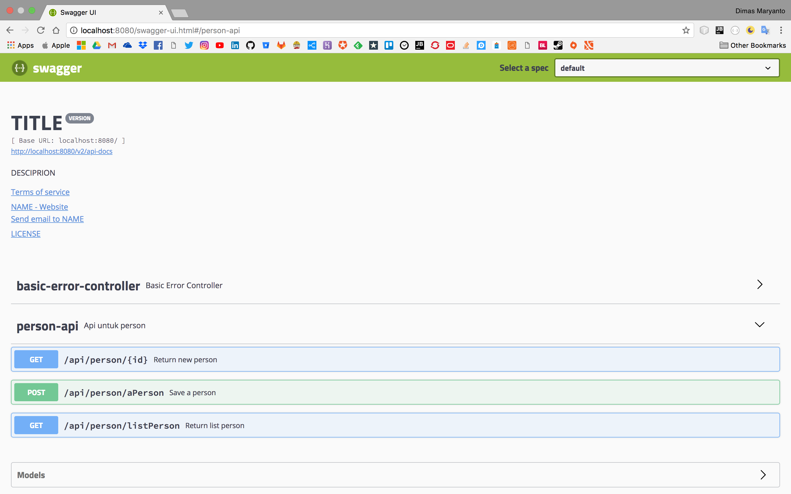

# Documentation Rest API with Swagger2

Membuat dokumentasi buat programmer itu kayak nulis cepen butuh waktu yang gak sedikit, nah maka dari itu ada fitur untuk membuat simple dokumentasi yang lumayan bagus di Springboot atau berbasis Spring Web MVC.

## Dependency

Dependency yang dibutuhkan atau yang harus ditambahkan di file `pom.xml` yaitu seperti berikut:

```xml
<dependencies>
    <!--dependencies lainnya... disini-->
    <dependency>
        <groupId>io.springfox</groupId>
        <artifactId>springfox-swagger2</artifactId>
        <version>2.8.0</version>
    </dependency>
    <dependency>
        <groupId>io.springfox</groupId>
        <artifactId>springfox-swagger-ui</artifactId>
        <version>2.8.0</version>
    </dependency>
    <dependency>
        <groupId>io.springfox</groupId>
        <artifactId>springfox-bean-validators</artifactId>
        <version>2.8.0</version>
    </dependency>
</dependencies>
```

## Configuration Spring Web MVC

```java 
@SpringBootApplication
@EnableSwagger2
@Import(BeanValidatorPluginsConfiguration.class)
public class SwaggerUIApplication {

    public static void main(String[] args) {
        SpringApplication.run(SwaggerUIApplication.class, args);
    }

    @Bean
    public Docket apiDocket() {
        return new Docket(DocumentationType.SWAGGER_2)
                .select()
                .apis(RequestHandlerSelectors.any())
                .paths(PathSelectors.any())
                .build()
                .apiInfo(getApiInfo());
    }

    private ApiInfo getApiInfo() {
        return new ApiInfo(
                "TITLE",
                "DESCIPRION",
                "VERSION",
                "TERMS OF SERVICE URL",
                new Contact("NAME", "URL", "EMAIL"),
                "LICENSE",
                "LICENSE URL",
                Collections.emptyList()
        );
    }
}
```

## Cara menggunakan 

```java 
@RestController
@RequestMapping("/api/person")
@Api(description = "Api untuk person")
public class PersonApi {

    @ApiOperation("Return new person")
    @GetMapping(value = "/{id}", produces = MediaType.APPLICATION_JSON_UTF8_VALUE)
    public Person getPerson(@ApiParam(value = "id person", required = true) @PathVariable Integer id) {
        return new Person(1, "Dimas", "Maryanto");
    }

    @ApiOperation("Return list person")
    @GetMapping(value = "/listPerson", produces = MediaType.APPLICATION_JSON_UTF8_VALUE)
    public List<Person> listPerson() {
        return Arrays.asList(
                new Person(1, "Dimas", "Maryanto"),
                new Person(2, "Muhamad", "Yusuf"),
                new Person(2, "Rega", "Rusti"),
                new Person(2, "Haidi", "Gufron")
        );
    }

    @ApiOperation("Save a person")
    @PostMapping(
            value = "/aPerson",
            produces = MediaType.APPLICATION_JSON_UTF8_VALUE,
            consumes = MediaType.APPLICATION_JSON_UTF8_VALUE)
    public Person getPerson(
            @ApiParam(value = "Person information for a new person to be created.", required = true, format = "application/json")
            @RequestBody Person person,
            @ApiParam(value = "Grade status like A | B | C | D | E", required = true)
            @RequestParam(required = false) Integer grade
    ) {
        return person;
    }
}
```

## Review the documentation

Berikut adalah cara menggunakan swagger-ui, dengan cara run project ini.

```bash
mvn clean spring-boot:run
```

Setelah project run, anda bisa browse [localhost:8080/swagger-ui.html](http://localhost:8080/swagger-ui.html)

Maka tampilannya seperti berikut:

